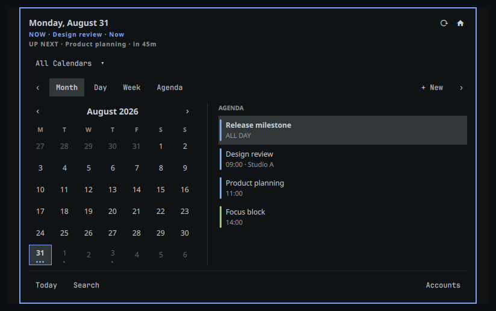

# OmaCalendar Omarchy widget

`org.omacalendar.widget` is the thin Omarchy Shell companion for OmaCalendar. It
shows a configurable clock and Up Next summary in the bar, then opens
keyboard-friendly Month, Day, Week, and Agenda views with search and inline
event editing. Calendar data, provider networking, credentials,
conflict resolution, and durable writes remain owned by `omacalendard`.



This repository is intentionally separate from the desktop application. The
widget has its own version and release cadence. Widget `0.1.0-beta.1` is the
public-testing candidate qualified against the published OmaCalendar
`1.0.0-alpha` runtime over IPC 2. That app version is compatibility evidence only: app
and widget versions, tags, and publication dates do not need to match. This
widget beta is not a stable or production-supported release.

## Requirements

- Omarchy 4.0 or newer with Quickshell plugin support
- Quickshell 0.3.1 or newer
- OmaCalendar `omacalendard` exposing IPC major 2
- The `omacalendard.socket` systemd user unit enabled

The desktop application does not need to remain open. The widget starts the
daemon through socket activation and reads its local cache.

## Install

Install and enable the widget from its public repository with:

```bash
omarchy plugin add https://github.com/brdweb/omacalendar-widget.git --enable
```

Open the popup by clicking the OmaCalendar item in the bar. Use the view tabs
or number keys `1`–`4` for Month, Day, Week, and Agenda. Press `N` to create an
event, `S` or `/` to search, and `T` to return to today.

## Update or remove

Update a Git-managed installation, including an existing alpha installation,
with:

```bash
omarchy plugin update org.omacalendar.widget
```

Remove a normal Omarchy installation with:

```bash
omarchy plugin remove org.omacalendar.widget
```

Removing the widget leaves the separately installed OmaCalendar application,
daemon, calendars, and credentials unchanged.

If the desktop application's transactional helper installed the widget and
replaced the clock or shortcut, restore the exact prior layout instead:

```bash
omacalendar-widgetctl restore
```

This removes only the managed widget files and restores the backed-up clock,
center anchor, and shortcut configuration.

## Safety and privacy boundaries

- The plugin connects only to the user-local Unix socket at
  `$XDG_RUNTIME_DIR/omacalendar/daemon.sock`.
- The installed `omacalendard.socket` starts the daemon on demand, so the
  desktop application does not need to be running. The first snapshot is read
  from the local cache while provider synchronization continues separately.
- It never opens the SQLite database, reads Secret Service, or contacts a
  calendar provider.
- The last presentation snapshot stays in memory if providers go offline or
  the daemon restarts. It is never persisted by the plugin.
- The socket client caps incoming frames at 1 MiB and requires IPC major 2.
- Meeting and OmaCalendar links are opened through `xdg-open`; arbitrary
  executable commands are never accepted from daemon data.
- A missing daemon or incompatible protocol prevents a fresh snapshot. Provider
  authorization, operation, conflict, and synchronization diagnostics stay in
  the desktop application; the widget quietly retains its last usable snapshot.

## Install for development

Validate the checkout first:

```bash
./tests/run.sh
```

Once this repository is published at its official trusted Git URL, Omarchy
installs it with:

```bash
omarchy plugin add https://github.com/brdweb/omacalendar-widget.git --enable
```

For a local prerelease checkout, use the desktop repository's transactional
helper:

```bash
omacalendar-widgetctl install --source /absolute/path/to/omacalendar-widget
```

The helper validates the plugin, enables the installed on-demand daemon socket,
replaces the clock in-place, adds the widget shortcut, records an exact rollback
journal, and restores the prior layout with `omacalendar-widgetctl restore`.

To enable an already installed checkout in the center section:

```bash
omarchy plugin enable org.omacalendar.widget --section center
```

Replacing `omarchy.clock`, changing `bar.centerAnchor`, or changing a Hyprland
shortcut is deliberately **not** done by plugin code. OmaCalendar's desktop
first-run activation flow owns that consented, backed-up, transactional change
and its exact restore operation. This checkout does not modify `~/.config` or
`/usr/share/omarchy`.

## Bar settings

The normal Omarchy inline widget settings are supported:

| Setting | Default | Meaning |
| --- | --- | --- |
| `format` | `ddd HH:mm` | Horizontal Qt date/time format |
| `verticalFormat` | `HH\n—\nmm` | Vertical-bar date/time format |
| `showUpNext` | `true` | Append the next event title |
| `showCountdown` | `true` | Append `Now`, minutes, hours, or days |
| `barPrivacy` | `full` | Set to `hidden` to suppress event titles |
| `weekStart` | locale | JavaScript weekday (`0` Sunday, `1` Monday) |
| `refreshSeconds` | `60` | Open-panel fallback refresh interval, minimum 15 |
| `socketPath` | XDG runtime socket | Development-only socket override |

Example after installation:

```bash
omarchy bar set org.omacalendar.widget barPrivacy hidden
```

## Daemon IPC 2 assumptions

The transport is newline-delimited UTF-8 JSON over the local socket. Every
request has `{id, protocolMajor: 2, method, params}`. Notifications have
`{event, data}`. The client first calls `system.info` and capability-gates every
subsequent action using the returned `methods` array.

Required handshake and snapshot methods:

- `system.info {}` returns `protocolMajor`, `protocolMinor`, `methods`, and
  presentation-safe server metadata.
- `system.subscribe {topics, sinceRevision}` subscribes the connection when
  available. Notifications carry a monotonic `data.revision`.
- `widget.snapshot {start, end, selectedDate, searchQuery, calendarSetId,
  sinceRevision?}` returns `{revision, generatedAt, stale, status,
  activeCalendarSet, calendarSets, calendars, events, upNext, conflicts,
  operations}`. It may instead return
  `{unchanged: true, revision}`.

Snapshot DTOs are presentation-only. In particular, they must not include
provider URLs, hrefs, ETags, sync tokens, credentials, raw ICS/JSON payloads,
or queued provider mutation bodies.

The widget consumes these presentation fields:

- Calendar: `id`, `name`, `color`, `readOnly`/`writable`, and optional
  capability labels.
- Event: `id`, `localRevision`, `calendarId`, `title`, `start`, `end`,
  `startDate`, `endDate`, `allDay`, `location`, `notes`, `meetingUrl`,
  `readOnly`, `pending`, `failed`, `recurring`, `recurrenceRule`,
  `recurrenceId` (or the legacy `occurrenceStart` compatibility alias),
  `organizer`, `attendeeStatus`, and `attendees`.
- Provider status, conflicts, and failed operations remain available to the
  desktop application. The widget silently keeps its last presentation-safe
  snapshot while the daemon reconnects or retries, without rendering account,
  sync, conflict, or operation error messages.

Mutation methods are capability-gated and use these exact envelopes:

- `events.create`: `clientMutationId`, `expectedLocalRevision: 0`,
  `recurrenceScope`, `guestNotificationPolicy`, `draft`.
- `events.update`: the same metadata plus `eventRef {eventId, recurrenceId}`
  and `patch`.
- `events.remove`: the same metadata and `eventRef`; it may return
  `undoToken` and `undoLabel` valid for ten seconds.
- `events.move`: the same event metadata plus `targetCalendarId`, `draft`, and
  `confirmedCrossProvider`. The widget only performs same-account moves;
  cross-account moves are handed to the desktop app for explicit confirmation.
- `events.undo`: `clientMutationId`, `undoToken`.
- `events.respond`: mutation metadata, `eventRef`, and `response` (`accepted`,
  `tentative`, or `declined`).
- `calendarSets.activate`: `clientMutationId`, `calendarSetId`.
- `operations.retry`: `clientMutationId`, `operationId`.
- `sync.all {}` starts synchronization and is treated as a command rather than
  an event mutation.

Timed editor drafts contain `calendarId`, `title`, `location`, `notes`,
`allDay: false`, UTC ISO `start`/`end`, and `timeMode: "zoned"`. All-day drafts
instead contain exclusive ISO `startDate`/`endDate`. Guest notification policy
is always explicit.

The widget hands complex workflows to these registered desktop links:

- `omacalendar://event/<id>`
- `omacalendar://new`
- `omacalendar://conflicts`
- `omacalendar://settings/accounts`

## Interaction

- Left-click opens the popup; middle-click refreshes; right-click opens the
  desktop app.
- The popup switches among Month, Day, Week, and Agenda views. Day and Week use
  a vertically scrollable time grid, preserve all-day events, and divide
  overlapping events into readable side-by-side columns. Number keys `1`–`4`
  switch directly to Month, Day, Week, and Agenda.
- Arrow keys move dates. `T` returns to today, `N` creates, `E` edits, `S` or
  `/` searches, `C` opens the calendar filter, and `R` refreshes. Agenda items
  open in the inline editor.
  Search exposes dedicated Clear and Close buttons; `Escape` also clears and
  closes it. `Ctrl+N`, `Ctrl+F`, and `Ctrl+Z` create, search, and undo.
- Recurring changes always expose an explicit occurrence/future/series scope.
- Guest-affecting create, edit, and delete actions expose an explicit notification
  policy. Invitation and reminder controls are intentionally omitted from the
  compact popup.
- The popup uses Omarchy's `KeyboardPanel`, theme tokens, spacing scale, and bar
  anchor primitives, so it follows all four bar edges, monitors, scaling, and
  theme hot reload behavior supplied by the host shell.

## Validation

`tests/run.sh` is the current-Omarchy integration suite. It performs:

- Manifest validation and warning-free QML linting against the installed shell.
- Portable thin-client, layout-wiring, and security-boundary contracts.
- Pure date/event model tests.
- IPC fixture tests for mutation envelopes and undo, a missed-revision full
  refresh, sync-state-only notifications at an unchanged database revision,
  cached data after disconnect, delayed daemon restart/reconnect, and
  incompatible protocol handling.
- Four-edge/multi-instance bar geometry smokes at 100%, 125%, and 200% Qt
  scaling. The popup itself delegates output selection and top/bottom/left/right
  placement to the current shell's `KeyboardPanel` anchor primitive.

`tests/run-portable.sh` runs the subset that needs only Python and Qt QML Test.
GitHub CI runs the complete headless suite in an Arch container against the
pinned Omarchy 4.0.2 release reference. Real compositor and hardware acceptance
still runs on a current Omarchy workstation.

Before a public release, the automated checks must still be followed by a real
Hyprland acceptance pass: open and keyboard-drive the popup on every edge, move
it between at least two differently scaled monitors, hot-reload a theme while it
is open, restart the real daemon, and verify provider-offline cached data. Those
compositor and hardware cases cannot be proven by an offscreen smoke test.

Regenerate the marketplace preview without reading real calendar data or
capturing the live desktop:

```bash
./tools/preview/capture-preview.sh
```

The capture runs the real panel and components on an isolated 800×800 Hyprland
headless output, feeds them a deterministic synthetic IPC snapshot, strips PNG
metadata, and rejects the result unless OCR finds the expected fixture labels
and no email address or local user path.

## Release candidates

The app and widget follow independent semantic versions. Each widget release
records the exact app version it was qualified against in `release.json` and
[`docs/COMPATIBILITY.md`](docs/COMPATIBILITY.md). A signed widget tag runs the
complete current-Omarchy gate, verifies the recorded app candidate tag, and
creates a **draft** candidate containing a deterministic source archive,
`SHA256SUMS`, an SPDX JSON SBOM, and GitHub provenance/SBOM attestations. It
never publishes a release automatically.

The current widget candidate is `0.1.0-beta.1`, qualified against OmaCalendar
`1.0.0-alpha`; the recorded target does not synchronize the
two release paths. Publication remains blocked until the candidate acceptance
record is complete. Marketplace publication steps and the ready-to-submit issue
body are in [docs/MARKETPLACE.md](docs/MARKETPLACE.md).
